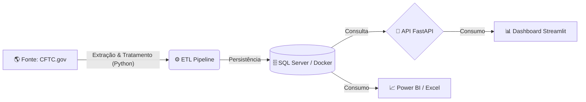

# 📊 Monitoramento de Mercado - COT Report (CFTC)

**Python | Streamlit | Pandas | Data Analysis | Status: Em Desenvolvimento**

🔗 **Dashboard Online:**  
https://carlos-henrique-junior-monitoramento-cftc-srcdashboard-vkog1v.streamlit.app

---

# 📈 Market Intelligence Suite - COT Report (CFTC)

Monitoramento de Smart Money e Posicionamento Institucional

Este projeto é uma solução completa de Engenharia e Análise de Dados que extrai, processa e visualiza os dados do relatório **Commitments of Traders (COT)** da CFTC.

O objetivo é identificar tendências de mercado com base no posicionamento de grandes fundos e especuladores institucionais.

A aplicação implementa um pipeline estruturado com persistência histórica e análise estatística aplicada para suporte à tomada de decisão.

---

# 🏗️ Arquitetura da Solução

O projeto segue o fluxo:

**ETL → Data Warehouse → API → Analytics**



---

# 🚀 Funcionalidades

## 1️⃣ Engenharia de Dados (ETL)

### 🔹 Extração Automática  
Download do histórico anual direto da CFTC (arquivos ZIP).

### 🔹 Limpeza e Tratamento
- Ajuste de datas  
- Padronização de tipagem  
- Remoção de nulos  

### 🔹 Cálculo de Métricas
```
Net Position = Long - Short
```

### 🔹 Persistência
Armazenamento em SQL Server via Docker.

---

## 2️⃣ Dashboard Interativo (Streamlit)

- KPIs de tendência  
- Sentimento de mercado (Bullish / Bearish)  
- Evolução histórica  
- Média, Mediana, Desvio padrão e Correlação  
- Gráficos de linha  
- Histogramas  
- Scatter plots  
- Filtros por Ativo, Exchange e Data  

---

## 3️⃣ API Backend (FastAPI)

- Endpoints REST  
- Documentação automática (Swagger UI)  
- Integração com outros sistemas  

---

# 🛠️ Tech Stack

- **Linguagem:** Python 3.12+  
- **Banco de Dados:** SQL Server (Docker)  
- **Backend:** FastAPI, Uvicorn  
- **Frontend:** Streamlit, Plotly  
- **Bibliotecas:** Pandas, SQLAlchemy, Requests, PyODBC  

---

# ⚙️ Como Executar o Projeto

## ✅ Pré-requisitos

- Python 3.x  
- Docker Desktop  
- Git  

---

## 1️⃣ Instalação

```bash
git clone https://github.com/Carlos-Henrique-Junior/monitoramento-cftc.git
cd monitoramento-cftc
pip install -r requirements.txt
```

---

## 2️⃣ Subindo o SQL Server (Docker)

```bash
docker run -e "ACCEPT_EULA=Y" \
-e "MSSQL_SA_PASSWORD=SuaSenhaForte!123" \
-p 1433:1433 \
-d mcr.microsoft.com/mssql/server:2022-latest
```

---

## 3️⃣ Executando o Pipeline

### ▶️ Rodar ETL

```bash
python src/etl_pipeline.py
python src/banco_dados.py
```

### ▶️ Iniciar Dashboard

```bash
streamlit run src/dashboard.py
```

### ▶️ (Opcional) Iniciar API

```bash
uvicorn src.api:app --reload
```

Documentação da API:

```
http://127.0.0.1:8000/docs
```

---

# 📊 Estrutura do Projeto

```
📦 monitoramento-cftc
 ┣ 📂 src
 ┃ ┣ 📜 etl_pipeline.py
 ┃ ┣ 📜 dashboard.py
 ┃ ┣ 📜 banco_dados.py
 ┃ ┗ 📜 api.py
 ┣ 📜 dados_dashboard.csv
 ┣ 📜 requirements.txt
 ┗ 📜 README.md
```

---

# 👨‍💻 Autor

**Carlos Henrique**

LinkedIn:  
https://www.linkedin.com/in/carlos-henrique-junior/

GitHub:  
https://github.com/Carlos-Henrique-Junior

Portfolio:
https://carlos-henrique-junior.github.io

Projeto desenvolvido como demonstração prática de pipeline de dados e visualização aplicada ao mercado financeiro.